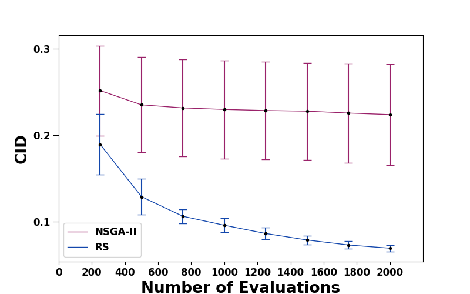
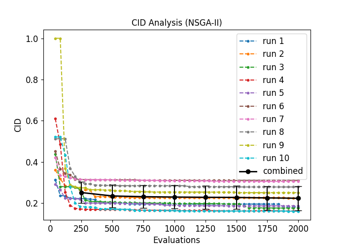
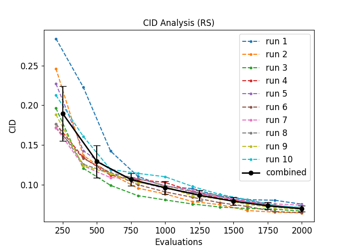
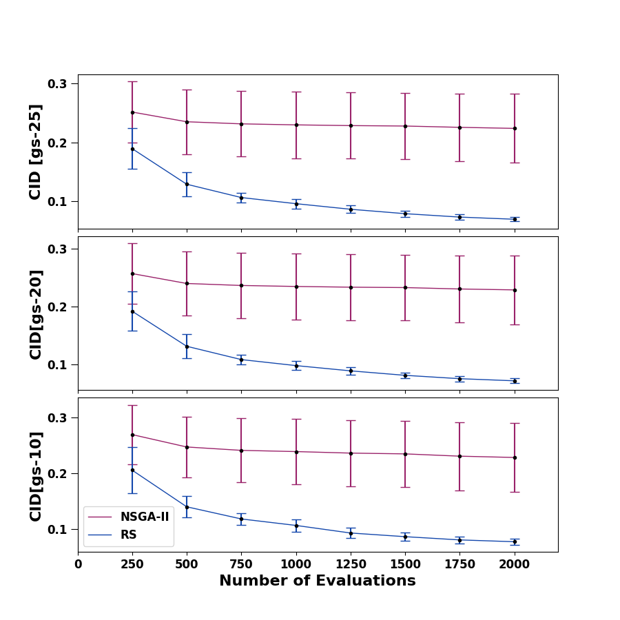
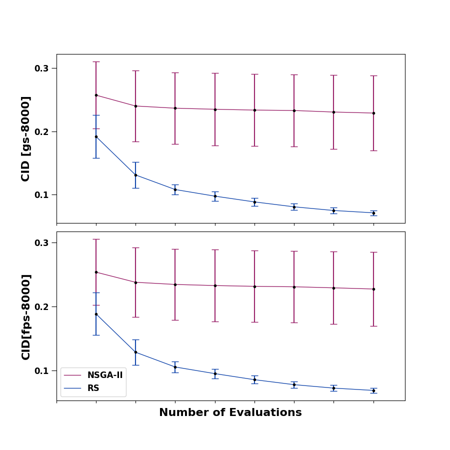

#  Data for Empirical Study Failure-Space Coverage
This repository holds the results of the empirical study from the paper **"Can Optimization-Driven SBST Effectively Cover Failure-Inducing Areas in a Search Domain? Insights from an ADS Case Study"**.
In this study the optimization algorithm NSGA-II is compared with random search in identifying failure revealing areas of an automated valet parking system.

## Implementation

The empirical study have been implemented using the [pymoo](https://pymoo.org) framework.
The implemenation of the CID metric is provided [here](code/metric/cid.py). The implemenation of grid sampling (GS) and furthest point sampling (FPS) is provided here [here](code/sampling/gs.py) and [here](code/sampling/fps.py).

## Evaluation Results

### Grid Sampling (15625 samples)

We provide here the results when using a reference set generated with grid sampling with 25 samples per dimension (15625 in total).

The following plot shows comparison of CID over 10 runs for NSGA-II and RS:

The detailed *CID* results/values are available here: [CID](/cid/gs_25/combined_CID.csv).

In the following we see an overview of *CID* values for each particular run:

NSGA-II         |  RS
:-------------------------:|:-------------------------:
  |  

The CID values for each run after the 2000 evaluation are available [here](cid/gs_25/overview_CID.csv).

### CID Robustness Study

The evaluation of the robustness of CID w.r.t. using another sampling for the reference set such as FPS and other resolutions is provided below.

Comparison Using Different GS Resolutions      |  Comparison Using FPS instead GS
:-------------------------:|:-------------------------:
 |   

The concrete CID values and further comparisons can be found using the following table:

Sampling        |  Number Samples | link
:-------------------------:|:-------------------------:|:--------------
FPS | 500 | [here](cid/fps_500/combined_CID.csv)
FPS | 1000 | [here](cid/fps_1000/combined_CID.csv)
FPS | 8000 | [here](cid/fps_8000/combined_CID.csv)
GS | 1000 |  [here](cid/gs_10/combined_CID.csv)
GS | 8000 |  [here](cid/gs_20/combined_CID.csv)
GS | 15625 |  [here](cid/gs_25/combined_CID.csv)

## Reference sets

### Grid sampling

15625 samples (25/axis)*      |  8000 samples (20/axis)*  | 1000 samples (10/axis)*
:-------------------------:|:-------------------------:|:-------------------------:
 |    |

### Furthest point sampling

8000 samples*    |  1000 samples* | 500 samples*
:-------------------------:|:-------------------------:|:-------------------------:
 |    |

*: Note, this is the total number of samples, not only the failure-revealing ones. While in the plots only failing samples are displayed.

## Failing Tests Single Runs

The results of each single run for of NSGA-II/RS are available here: 

[Single Runs NSGA-II](NSGA-II/) \
[Single Runs RS](RS/)

Note, that the input space plots of identified failing test cases are in the corresponding *run_x/design_space* directory of each run *x*.
E.g., the input space plots of run 1 of NSGA-II are provided [NSGA-II/run_1/design_space/](NSGA-II/run_1/design_space/)
